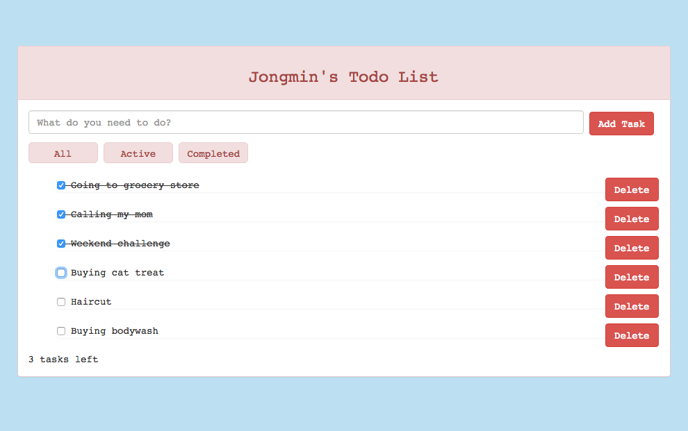

# Todo Challenge
===================
This is the 8th weekend challenge, which is to create a todo list using AngularJS.



Getting Started
-----
```
$ git clone git@github.com:jongmin141215/todo_challenge.git
$ cd todo_challenge
$ npm install
$ bower install
$ npm start
```

Visit http://localhost:8080

Features
-----
* Users can add/delete tasks.
* Users can filter tasks on completion status.

Still to do
------
* Add ability to persist to localstorage
* Deploy to Heroku/Amazon S3

Technologies
-----
* Frontend Framework: AngularJS
* Testing: Jasmine, Protractor, Karma
* Styling: Bootstrap
